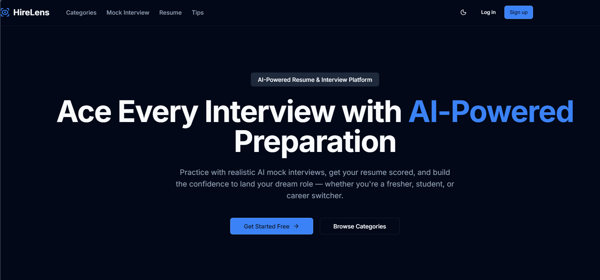
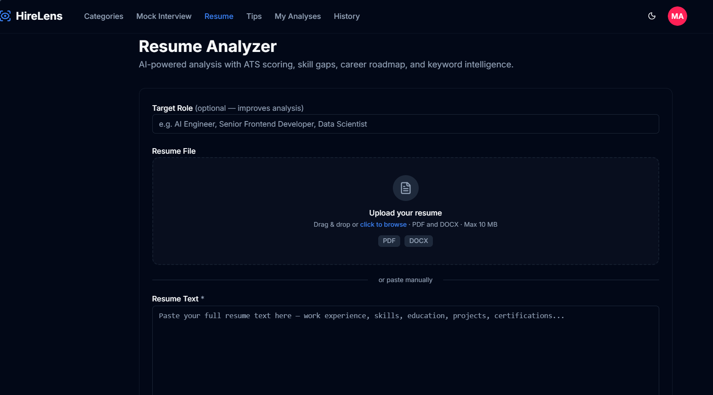
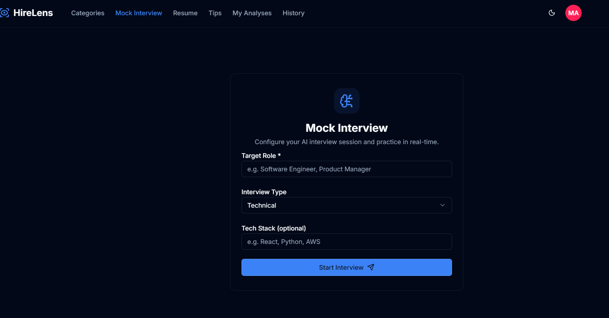
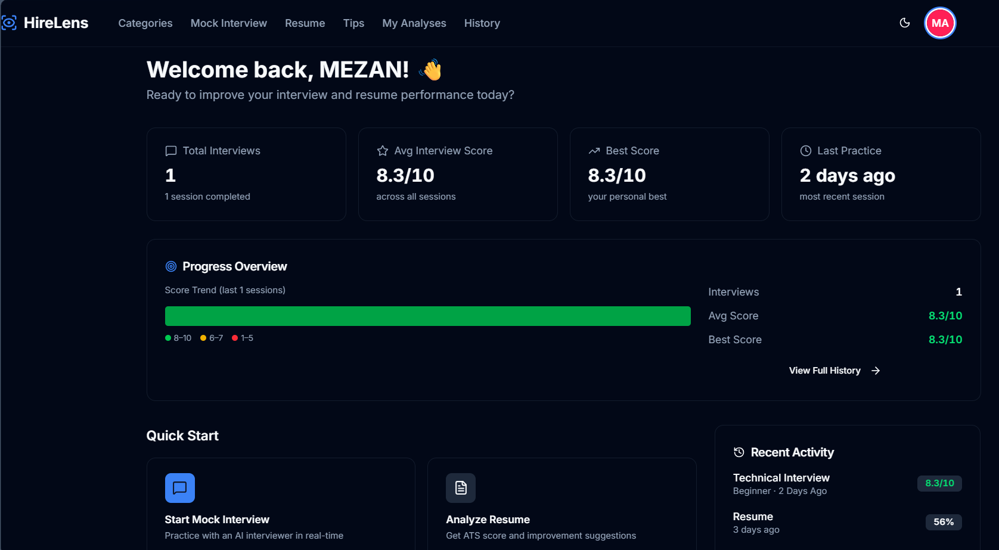
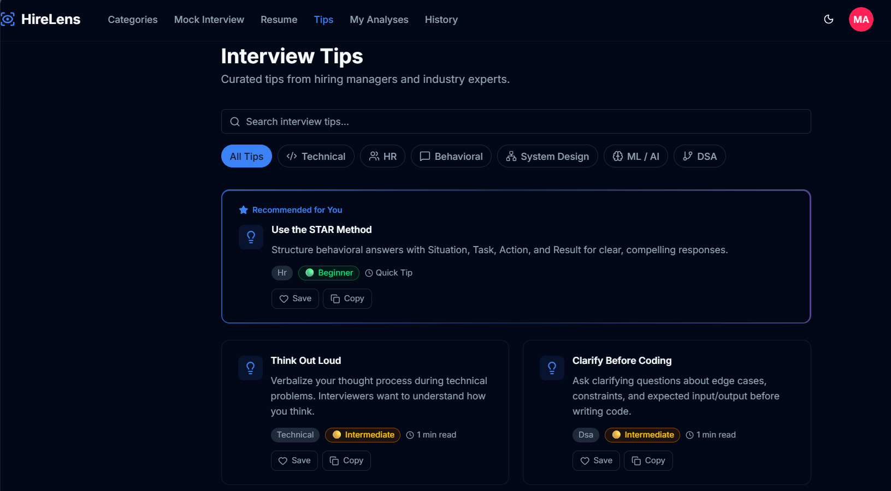

<div align="center">

# 🚀 HireLens
### AI-Powered Resume Analyzer & Interview Preparation Platform

<p align="center">
An intelligent web application that helps students, freshers, and job seekers improve their resumes, evaluate ATS compatibility, and prepare for interviews using AI-powered tools.
</p>

<p align="center">


</p>

<p align="center">

<a href="https://interview-coach--meezakhtar.replit.app">

</a>

<a href="https://github.com/mezanakhtar/HireLens">

</a>

</p>

</div>

---

# 📖 About the Project

HireLens is an AI-powered Resume Analyzer and Interview Preparation Platform designed to help students, freshers, and job seekers prepare confidently for technical and HR interviews.

The platform combines resume analysis, ATS evaluation, interview practice, and AI-powered guidance into one modern web application.

Whether you're preparing for your first internship or your dream job, HireLens provides tools to improve your resume and strengthen your interview skills.

---

# ✨ Features

## 📄 Resume Analyzer

- Upload PDF resumes
- ATS compatibility analysis
- Resume quality evaluation
- Missing skills identification
- Resume improvement suggestions

---

## 🤖 AI Interview Preparation

- AI-generated interview questions
- Technical interview practice
- HR interview preparation
- Difficulty-based interview rounds
- Interview tips and guidance

---

## 📊 User Dashboard

- Resume analysis history
- Previous interview sessions
- Progress tracking
- Personalized dashboard

---

## 🔐 Authentication

- User Registration
- Secure Login
- Firebase Authentication
- Protected Routes

---

## 🎨 User Experience

- Responsive Design
- Dark / Light Mode
- Modern UI
- Mobile Friendly
- Clean Navigation

---

# 🛠 Tech Stack

| Category | Technologies |
|-----------|--------------|
| Frontend | React, TypeScript, Vite |
| Styling | Tailwind CSS |
| Authentication | Firebase Authentication |
| Database | Firebase Firestore |
| AI Integration | Google Gemini AI |
| Routing | React Router |
| State Management | React Context API |
| Icons | Lucide React |

---

# 📸 Application Screenshots

## 🏠 Home Page

> *<p align="center">
  
</p>*

```
screenshots/home.png
```

---

## 📄 Resume Analyzer

> *<p align="center">
  
</p>*

```
screenshots/resume-analyzer.png
```

---

## 🤖 Mock Interview

> *<p align="center">
  
</p>*

```
screenshots/mock-interview.png
```

---

## 📊 Dashboard

> *<p align="center">
  
</p>*

```
screenshots/dashboard.png
```

---

## 💡 Interview Tips

> *<p align="center">
  
</p>*

```
screenshots/tips.png
```

---

# 📂 Project Structure

```text
HireLens
│
├── public/
│
├── src/
│   ├── components/
│   ├── contexts/
│   ├── hooks/
│   ├── lib/
│   ├── pages/
│   ├── App.tsx
│   └── main.tsx
│
├── package.json
├── vite.config.ts
├── tsconfig.json
└── README.md
```

---

# 🚀 Getting Started

## Clone the Repository

```bash
git clone https://github.com/mezanakhtar/HireLens.git
```

---

## Navigate to Project

```bash
cd HireLens
```

---

## Install Dependencies

```bash
npm install
```

---

## Run the Development Server

```bash
npm run dev
```

---

## Build for Production

```bash
npm run build
```

---

# 🌐 Live Demo

🔗 **Website**

**https://interview-coach--meezakhtar.replit.app**

---

# 🎯 Future Roadmap

- 🎤 AI Voice Interview
- 📹 Video Interview Practice
- 📈 Interview Performance Analytics
- 🤖 Personalized AI Career Roadmap
- 💼 Company-Specific Interview Preparation
- 📑 Resume Version Comparison
- 🌍 Multi-language Support
- 📱 Mobile Application

---

# 💡 Learning Outcomes

This project helped me strengthen my understanding of:

- React Development
- TypeScript
- Firebase Authentication
- Firestore Database
- AI API Integration
- Resume Parsing
- ATS Evaluation Concepts
- UI/UX Design
- State Management
- Modern Frontend Development

---

# 👨‍💻 Author

## Mezan Akhtar

AI & Machine Learning Engineer

📧 Email:
**meezakhtar@gmail.com**

🔗 LinkedIn:
**https://www.linkedin.com/in/mezan-a-72861b258/**

💻 GitHub:
**https://github.com/mezanakhtar**

---

# 🤝 Contributing

Contributions, suggestions, and feedback are welcome.

If you have ideas for improving HireLens, feel free to fork the repository and submit a pull request.

---

# ⭐ Support

If you found this project useful,

⭐ **Please consider giving this repository a Star.**

It helps others discover the project and supports future improvements.

---

<div align="center">

### 🚀 Thank you for visiting HireLens!

Built with ❤️ using React, Firebase & AI.

</div>
